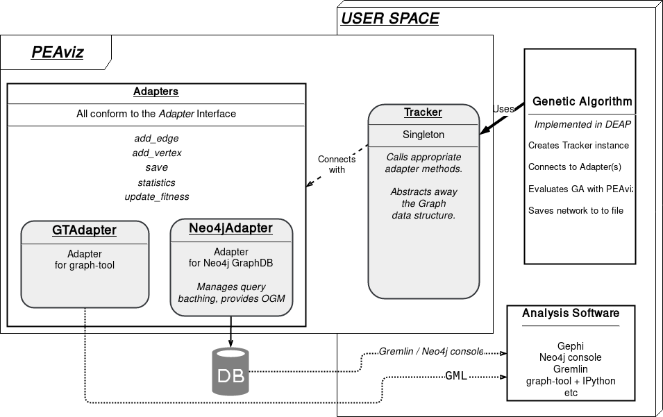

.. include:: role_defs.rst

.. _arch_docs:

Architecture
============

PEAviz is composed of 3 elements, **Adapters**, **Trackers** and **Encoding strategy**.

Adapter
    A module that implements all actions required to create the Graph data structure and maintain it. This could be,
    
    * a :class:`graph_tool.Graph` or,
    * a neo4j DB connection via :mod:`py2neo` or,
    * a Gephi_ GephiStreamer_ object *(see* GraphStream_ *)*.

    All adapters conform to a minimal :ref:`interface <adapter_intf>`.

Encoding Strategy
    This details when and how individuals and edges are inserted in the network, whether the edges are directed or undirected, their semantics, etc.

Tracker
    Your GA creates an instance of this and connects it to the desired Adapter(s). The Tracker uses the chosen Encoding Strategy to invoke Adapter methods and create the desired evolutionary network.

.. note::
   Trackers and Encoding Strategy are highly coupled, ie, a new Tracker is required for a new Encoding Strategy.

Elements
--------

1. Adapters

    - :green:`graph-tool` [*]_
    - :red:`Neo4j` [*]_
    - :orange:`GraphStream` [*]_
2. Trackers

    - ``Base`` :green:`tracker for the default strategy.`
3. Encoding Strategies

    - :green:`Default Strategy`

Default Encoding Strategy
-------------------------

For each individual added into the population,

1. A node is created.

    - two or more nodes can encode the same individual (genetic material) because the same individual can be *added into the population* at different iterations, possibly with different parents.
    - Thus, nodes are NOT UNIQUE.
2. Edges are added from parents to *this* node.

    - The network might have parallel edges, as the selection process of a GA might allow the same individual to be picked twice, as a parent!

To find out more about the approach refer
    
    Davendra, Donald, et al. "Complex network analysis of differential evolution algorithm applied to flowshop with no-wait problem." Differential Evolution (SDE), 2014 IEEE Symposium on. IEEE, 2014.

on `IEEE Xplore <http://ieeexplore.ieee.org/abstract/document/6900441/>`_. The paper above uses this strategy to study a Self Organising Migrating Algorithm, but the strategy can be used to study other EAs too.

.. [*] :green:`Green denotes completed.`
.. [*] :red:`Red denotes future goals.`
.. [*] :orange:`Orange denotes partial completion.`

.. _GephiStreamer: https://github.com/totetmatt/GephiStreamer
