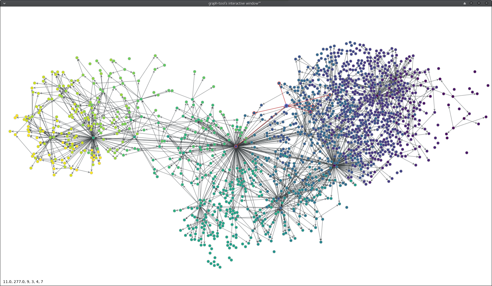

.. PEAviz documentation master file, created by
   sphinx-quickstart on Sat Jun  3 16:47:28 2017.
   You can adapt this file completely to your liking, but it should at least
   contain the root `toctree` directive.

Welcome to PEAviz's documentation!
==================================

*Python Evolutionary Algorithm Visualistaion toolkit on DEAP*

Release v\ |release|. (:ref:`Installation <install>`)

.. image:: https://requires.io/github/arrow-/PEAviz/requirements.svg?branch=master
   :alt: requirement's status
   :target: https://requires.io/github/arrow-/PEAviz/requirements/?branch=master)

.. toctree::
   :maxdepth: 2
   :caption: Contents:

   arch
   install_use
   trackers
   adapters
   encoding_strategy
   algorithms

Introduction
------------
PEAviz bridges DEAP_ with graph analysis tools like `graph-tool <http://graph-tool.skewed.de/>`_, gremlin_ or Gephi_. DEAP_ is an amazing platform for implementing and experimenting Evolutionary Algorithms in the python programming language.

The aim of PEAviz is to help track the evolutionary dynamics of such algorithms by encoding desired information in a graph (network) structure. It goes somewhat beyond DEAP's inbuilt ``History`` object `(ref) <http://deap.gel.ulaval.ca/doc/dev/api/tools.html#history>`_.

Evolutionary dynamics are not very well understood yet, and the network generated by PEAviz can provide not just experimental data but analysis might uncover previously unknown facts and patterns. The analysis might also provide proof for known hypothesis on GA behaviours!

Alas, as of mid 2017, there is no universally accepted way of tranforming dynamics into a network, and the default transformation (which is called **Encoding Strategy**) implemented in PEAviz, is not necessarily the best one.

.. include:: faq.rst

Results
-------

The graph below captures the dynamics of a GA that was implemented using PEAviz and DEAP which solved an instance of the simple *0-1 Knapsack problem*.

.. note:: This work is part of our Undergraduate Degree Course Work.

Indices and tables
==================

* :ref:`genindex`
* :ref:`modindex`
* :ref:`search`

.. _gremlin: http://tinkerpop.apache.org/
